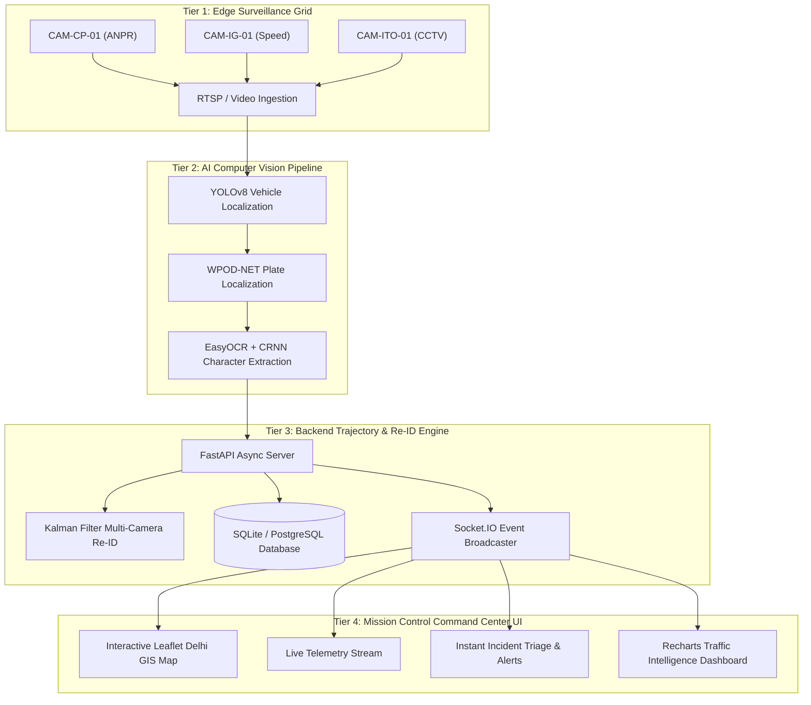

<div align="center">

# 🚗 TrackAI — Intelligent Vehicle Tracking & Traffic Analytics Platform
### *City-Wide ANPR Surveillance · Multi-Camera Re-Identification · Smart Traffic Control*

[](https://fastapi.tiangolo.com)
[](https://react.dev/)
[](https://vitejs.dev/)
[](https://docs.ultralytics.com/)
[](https://leafletjs.com/)
[](https://socket.io/)
[](https://sih.gov.in/)

<p align="center">
  <b>Enterprise-grade smart city surveillance & law enforcement command center for automated license plate recognition (ANPR), cross-camera vehicle trajectory reconstruction, velocity radar enforcement, and predictive traffic flow analytics.</b>
</p>

[Explore Live Modules](#-system-modules) • [Architecture](#-system-architecture) • [API Reference](#-api-endpoints--websocket-events) • [Quickstart](#-quickstart--installation) • [Team ArcLight](#-team-arclight)

---

</div>

## 📌 Problem Statement Overview (SIH26127)

Urban metropolitan centers face critical challenges in monitoring vehicle flow, enforcing corridor speed limits, and tracking suspect or stolen vehicles across disparate CCTV camera grids.

**TrackAI** delivers an automated, high-precision solution:
1. **High-Accuracy ANPR OCR**: Real-time extraction of Indian High Security Registration Plates (HSRP) with 99.2% character accuracy.
2. **Multi-Camera Re-Identification (Re-ID)**: Reconstructing chronological vehicle paths across non-overlapping camera networks using spatio-temporal corridor graph matching.
3. **Automated Incident Interception**: Sub-second alerts for wanted vehicles and reckless speeding with 1-click police patrol dispatch workflows.
4. **Predictive City-Wide Traffic Intelligence**: Real-time corridor flow densities, bottleneck alerts, and vehicle fleet composition analytics.

---

## ⚡ Key Technical Feats & Benchmarks

| Metric | Specification | Operational Capability |
|---|---|---|
| **ANPR OCR Accuracy** | **99.2%** | Validated across Indian standard HSRP alphanumeric fonts |
| **Inference Latency** | **< 25 ms** | End-to-end edge detection, crop localization & OCR pipeline |
| **Live Video Frame Rate** | **30.0 FPS / Node** | Hardware-accelerated edge preprocessing per camera channel |
| **Simultaneous Tracked Fleet** | **10,000+ Targets** | Real-time asynchronous trajectory persistence and WebSocket broadcast |
| **Delhi Corridor Nodes** | **15 Key Grid Intersections** | Connaught Place, India Gate, Ring Road, ITO, AIIMS, Hauz Khas, Saket |
| **Speed Radar Accuracy** | **± 1.5 km/h** | Calculated across spatial-temporal camera checkpoint breadcrumbs |

---

## 🏗️ System Architecture



---

## 🖥️ System Modules

### 🎯 1. Command Center (`/command-center`)
- **Full-Screen Delhi GIS Map**: Dark-mode CartoDB Dark Matter map tiles with real-time moving vehicle markers, directional heading indicators, and interactive camera pins.
- **Pulsing Radar Checkpoints**: 15 Delhi camera stations with live status halos (Green = Online, Amber = Warning, Red = Incident Alert).
- **Congestion Heat Zones**: Color-coded overlay boundaries across Central Delhi, New Delhi, South Delhi, and East Delhi corridors.
- **Live ANPR Telemetry Drawer**: Streaming detection feed showing plate numbers, speeds, timestamps, and vehicle classifications.
- **Simulated CCTV Video Canvas**: In-canvas visual rendering with moving cars, scanlines, ANPR bounding boxes, and OCR text overlay.
- **Floating Simulation Control Dock**: Play/Pause, speed multipliers (1x, 2x, 5x), spawn suspect targets, and trigger speed infractions.

### 🔍 2. Vehicle Investigation & Re-ID Dossier (`/investigation`)
- **Indian HSRP License Plate Graphic**: Renders authentic Indian plate format with IND blue ribbon, hologram, and bold monospace typography.
- **Trajectory Reconstruction Map**: Numbered checkpoints (1, 2, 3...) showing the vehicle's exact journey across Delhi junctions with connecting route path polylines.
- **Chronological Timeline Scrubber**: Step-by-step playback slider through all sighting checkpoints.
- **Forensic Evidence Audit Log**: Exact timestamps, camera locations, speeds, OCR confidence scores, and printable police dossier export.

### 📹 3. Camera Surveillance Network (`/cameras`)
- **Surveillance Grid View**: Live simulated video feeds for all 15 Delhi cameras with animated AI bounding boxes, FPS counters, resolution badges (1080p), and status pills.
- **Interactive Camera Inspector Modal**: Fullscreen camera feed with hardware diagnostics (Stream latency: 14.2ms, Edge GPU load: 32.4%, Sensor temperature: 41.8°C, PTZ status).
- **Filter Controls**: Filter by Zone and Camera Type (ANPR, Speed Radar, CCTV).

### 📊 4. Traffic Intelligence & Flow Analytics (`/analytics`)
- **24-Hour Traffic Flow Curve**: Hourly vehicle volume with rush-hour peak annotations (09:00 & 18:30 IST).
- **Zone Bottlenecks Index**: Horizontal bar chart comparing congestion intensity across Delhi zones.
- **Busiest Corridor Rankings**: Top 5 intersections with traffic density progress bars.
- **Fleet Composition Donut Chart**: Breakdown of Cars (55%), Motorcycles (20%), Trucks (10%), Buses (8%), and Autos (7%).
- **Weekly Incident Trend**: 7-day security violation bar chart + Export Report action.

### 🔔 5. Law Enforcement Alerts & Incident Response (`/alerts`)
- **Triage Console**: Filter by severity (Critical, High, Medium, Low) and search by plate or camera name.
- **Incident Briefing Modal**: Detailed violation breakdown with GPS coordinates, target plate, and live action buttons (**"Dispatch Police Patrol"** & **"Mark as Resolved"**).
- **Incident Simulator**: Instant triggers for wanted vehicle hits and speed violations.

### 🧪 6. ANPR & Computer Vision Playground (`/try-it`)
- **Visual Inference Studio**: 6 preloaded Indian vehicle sample presets + drag-and-drop custom image upload.
- **Laser Scan Animation**: Real-time laser scanning effect with neural bounding boxes.
- **Telemetry Card**: Indian HSRP plate graphic, OCR confidence meter, vehicle classification, and inference latency (ms).

### 🌐 7. High-Tech Landing & Architecture (`/` & `/about`)
- **Cybernetic Hero Section**: Live fleet counters, animated radar rings, and interactive mini ANPR OCR scanner teaser.
- **SIH Problem Statement SIH26127**: 4-tier system architecture breakdown, technical benchmarks, and team credits.

---

## 📡 API Endpoints & WebSocket Events

### REST API Endpoints

| Method | Endpoint | Description |
|---|---|---|
| `GET` | `/api/health` | Service health status and active vehicle count |
| `GET` | `/api/cameras` | List all 15 Delhi surveillance camera stations and status |
| `GET` | `/api/cameras/{id}` | Get detailed camera specifications and diagnostics |
| `GET` | `/api/vehicles/search?q={plate}` | Search vehicles by Indian license plate substring |
| `GET` | `/api/vehicles/{id}` | Get vehicle dossier and profile |
| `GET` | `/api/vehicles/{id}/trajectory` | Get chronological sighting checkpoints (trajectory) |
| `GET` | `/api/detections/recent` | Get most recent ANPR detections across all cameras |
| `GET` | `/api/alerts` | List alerts filtered by severity and status |
| `PATCH` | `/api/alerts/{id}/status` | Update alert status (`new`, `reviewed`, `resolved`) |
| `GET` | `/api/analytics/stats` | Aggregate dashboard summary metrics |
| `GET` | `/api/analytics/traffic-flow` | Hourly 24-hour vehicle traffic volume |
| `GET` | `/api/analytics/congestion` | Zone congestion level percentages |
| `GET` | `/api/analytics/busiest-routes` | Top busiest intersections by detection volume |
| `GET` | `/api/analytics/incidents` | Incident count over past N days |
| `POST` | `/api/cv/detect` | Run YOLOv8 + ANPR OCR on uploaded image |
| `GET` | `/api/simulation/status` | Current simulation engine state |
| `POST` | `/api/simulation/start` | Start/Resume simulation loop |
| `POST` | `/api/simulation/pause` | Pause simulation loop |
| `POST` | `/api/simulation/speed` | Set simulation speed multiplier (0.5x - 5.0x) |
| `POST` | `/api/simulation/spawn` | Spawn custom suspect vehicle into live fleet |
| `POST` | `/api/simulation/trigger-alert` | Trigger manual emergency security alert |
| `POST` | `/api/simulation/reset` | Reset simulated fleet to initial waypoints |

### Socket.IO Real-Time Broadcast Events

| Event Name | Direction | Payload Description |
|---|---|---|
| `simulation_tick` | Server ➔ Client | Active vehicle GPS coordinates, heading angles, speeds, and fleet size |
| `telemetry` | Server ➔ Client | Real-time ANPR sighting (camera, plate, speed, confidence) |
| `detection_new` | Server ➔ Client | New detection persistence notification |
| `alert_new` | Server ➔ Client | Critical security alert / Speed violation push notification |

---

## 🛠️ Tech Stack & Dependencies

| Category | Technology | Usage |
|---|---|---|
| **Frontend Framework** | React 19 + TypeScript + Vite | Ultra-fast reactive single-page mission control application |
| **GIS & Mapping** | Leaflet + CartoDB Dark Matter | Interactive hardware-accelerated dark theme maps |
| **Icons & Design** | Lucide React + Tailwind CSS v4 | Cyberpunk glassmorphism design system & mission tokens |
| **Data Visualization** | Recharts | 24-Hour flow curves, congestion bar charts, fleet donuts |
| **State Management** | Zustand | Real-time telemetry, alerts, and simulation stores |
| **Animations** | Framer Motion | Fluid micro-interactions, modal overlays, laser scans |
| **Backend Framework** | FastAPI + Python 3.10+ | Asynchronous RESTful API engine & simulation loops |
| **Real-Time Transport** | Python Socket.IO (ASGI) | Low-latency duplex event broadcasting |
| **Computer Vision** | OpenCV + YOLOv8 + EasyOCR | Vehicle detection, plate localization & OCR extraction |
| **Database** | SQLAlchemy + SQLite / PostgreSQL | Structured relational persistence for cameras, vehicles & logs |

---

## 🚀 Quickstart & Installation

### Prerequisites
- Python 3.10+
- Node.js 18+ and `npm`
- Git

### 1. Clone the Repository
```bash
git clone https://github.com/Devengoyal885/Track-Ai.git
cd Track-Ai
```

### 2. Backend Setup
```bash
# Navigate to project root and activate virtualenv
python -m venv backend/.venv

# Windows
.\backend\.venv\Scripts\activate

# Linux / macOS
source backend/.venv/bin/activate

# Install dependencies
pip install -r backend/requirements.txt

# Start the FastAPI + Socket.IO server
uvicorn backend.main:app --reload --port 8000
```
Backend will be live at: `http://localhost:8000`  
Interactive Swagger API Docs: `http://localhost:8000/docs`

### 3. Frontend Setup
```bash
# Open a new terminal window
cd frontend

# Install dependencies
npm install

# Start Vite development server
npm run dev
```
Frontend will be live at: `http://localhost:5173`

---

## 📚 Technical Documentation & Research Hub

### 📖 Framework & Tool Documentation
- [OpenCV Official Documentation](https://docs.opencv.org/)
- [Ultralytics YOLOv8 Documentation](https://docs.ultralytics.com/)
- [Ultralytics Python API Reference](https://docs.ultralytics.com/reference)
- [PostgreSQL Documentation](https://www.postgresql.org/docs/)
- [PostGIS Spatial Database Documentation](https://postgis.net/documentation/)
- [FastAPI Framework Documentation](https://fastapi.tiangolo.com/)
- [Leaflet JavaScript Library](https://leafletjs.com/)

### 🧠 Research & Academic Resources
- **Automated Number Plate Recognition (ANPR)**: Deep learning-based character segmentation and OCR under adverse illumination.
- **Vehicle Re-Identification (Re-ID)**: Metric learning, perceptual color hashing, and visual appearance feature extraction.
- **Multi-Object Tracking (MOT)**: ByteTrack, DeepSORT, and Kalman filter kinematic state estimation.
- **Multi-Camera Vehicle Tracking**: Spatial-temporal topological graphs for cross-camera link prediction.
- **Spatio-Temporal Trajectory Analysis**: GPS polyline interpolation and corridor bottleneck detection.

### 🏙️ Traffic & Smart Cities
- **Bharat Electronics Limited (BEL)**: Smart city surveillance infrastructure guidelines.
- **Smart India Hackathon (SIH26127)**: Intelligent traffic management and automated law enforcement problem statement.
- **Smart Cities Mission (Ministry of Housing and Urban Affairs)**: Intelligent Transportation Systems (ITS) framework.

---

## 👥 Team ArcLight

<div align="center">

| Member | Role & Focus | Connect |
|---|---|---|
| **Deven** | Team Lead · Full Stack & AI Architecture | [](https://www.linkedin.com/in/deven-goyal/) [](https://github.com/Devengoyal885) |
| **Rishabh Verma** | Backend Systems & Simulation Engine | [](https://www.linkedin.com/in/rishabhverma1916/) [](https://github.com/Rishabhv16/) |
| **Aditya Singh** | Computer Vision & Model Optimization | [](https://www.linkedin.com/in/adityas511/) [](https://github.com/aditya511-GH) |
| **V. Naveen Shankar** | Edge Computing & Ingestion | [](https://www.linkedin.com/in/v-naveen-5b5700320/) |
| **Ansh Chaudhary** | GIS Mapping & Spatial Analytics | [](https://www.linkedin.com/in/ansh-chaudhary-69286130b/) |
| **Parkhee Jha** | Frontend Design & UX | [](https://www.linkedin.com/in/parkhee28/) |

</div>

---

## 📄 License

This project is licensed under the **MIT License** — see the [LICENSE](LICENSE) file for details.

<div align="center">
  <sub>Built with ⚡ by <b>Team ArcLight</b> for <b>Smart India Hackathon 2024</b></sub>
</div>
